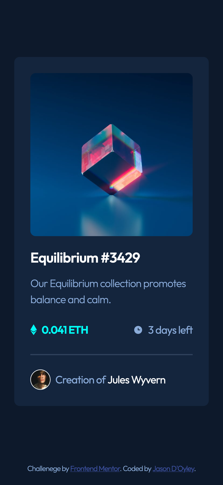
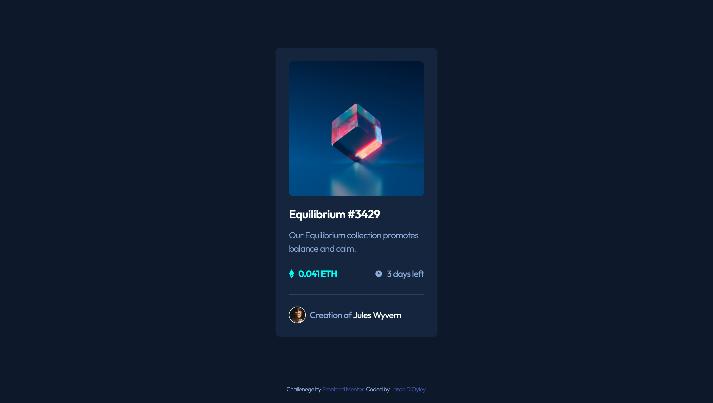

# Frontend Mentor - NFT preview card component solution

This is a solution to the [NFT preview card component challenge on Frontend Mentor](https://www.frontendmentor.io/challenges/nft-preview-card-component-SbdUL_w0U). Frontend Mentor challenegs help you improve your coding skills by building realistic projects.

## Table of contents

- [Overview](#overview)
  - [The challenge](#the-challenge)
  - [Screenshot](#screenshot)
  - [Links](#links)
- [My process](#my-process)
  - [Built with](#built-with)
  - [What I learned](#what-i-learned)
  - [Continued development](#continued-development)
  - [Useful resources](#useful-resources)
- [Author](#author)
- [Acknowledgments](#acknowledgments)

## Overview

For this challenege I am to build out the NFT preview card component and get it to look as close as possible to the design as possible.

### The challenege

Users should be able to:

- View the optimal layout depending on their device's screen size
- See hover states for interactive elements

### Screenshot

### Links

- Solution URL: [View solution](https://nft-preview-card-component-rho.vercel.app/)
- Live Site URL: [View live site](https://nft-preview-card-component-rho.vercel.app/)
- Prototype URL: [Click to view.](https://www.figma.com/proto/MGA2f2o0GmxfdNL4RJlXGh/NFT-Preview-Card-Component?page-id=71%3A64&node-id=59%3A255&viewport=323%2C48%2C1.06&scaling=min-zoom&starting-point-node-id=59%3A255&hide-ui=1)
- Repository URL: [Add live site URL here](https://github.com/jdfdoyley/nft-preview-card-component)

## My process

### Built with

- Semantic HTML5 markup
- Sass (Scss)
- Flexbox
- Mobile-first workflow

### What I learned

In this challenege I was able to practice using Sass (variables, partials).

### Continued development

In future projects I will continue working on gaining getter understanding of Sass, Flexbox, Grid and React. I think I still need more practice using these tools.

### Useful resources

- [Sass](https://sass-lang.com/guide) - This helped me with understanding the basic concepts of variables and partials.
- [Kevin Powell YouTube](https://www.youtube.com/watch?v=wYWf2m_yzBQ&t=914s) - Thought me how to use parcel to bundle and use Sass.
- [Parcel](https://parceljs.org/) -  I was able to use the Parcel website to understand further how things work.

## Author

- LinkedIn - [jdfdoyley](https://www.linkedin.com/in/jdfdoyley/)
- Frontend Mentor - [jdfdoyley](https://www.frontendmentor.io/profile/jdfdoyley)
- GitHub - [jdfdoyley](https://github.com/jdfdoyley)
- Varcel - [jdfdoyley](https://vercel.com/dashboard)
- CodePen - [jdfdoyley_](https://codepen.io/jdfdoyley_)

## Acknowledgments

I want to give a big shout out to [Kevin Powell](https://www.youtube.com/channel/UCJZv4d5rbIKd4QHMPkcABCw) YouTube channel. I was able to get a better understanding of Sass and Parcel.
